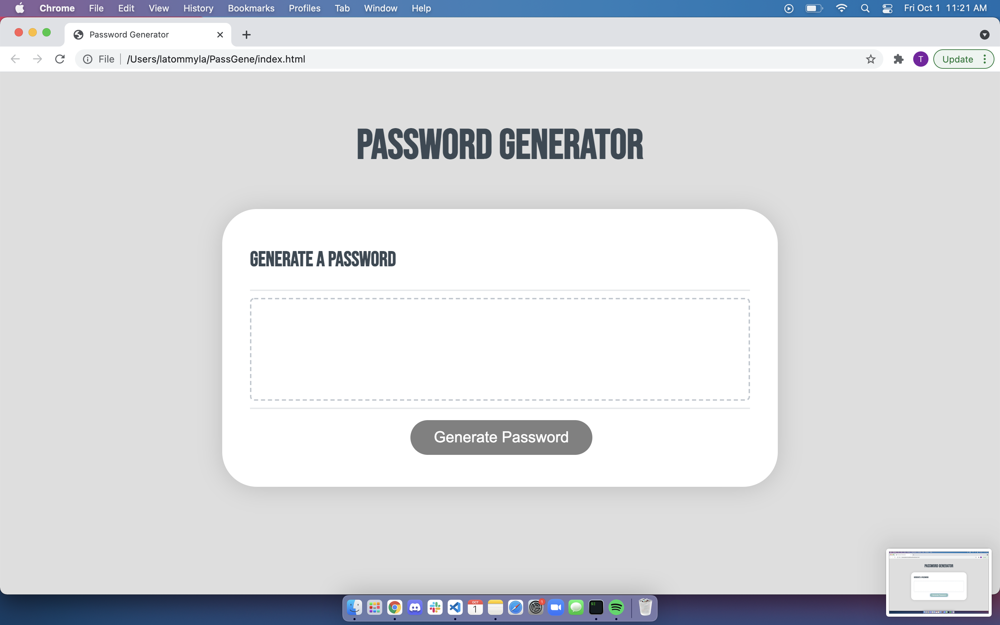

# PassGene
Password Generator with prompts to select which characters, number, and symbols.

This project was a huge learning experience and definitely very new to me. Javascript is not my cup of tea, but I'm willing to learn how to make all the functions work together and figuring this new type of coding.

## Demo and sources
- [GitHub Repo](https://github.com/latommyla/PassGene)
- [GitHub Deployed Live URL](https://latommyla.github.io/PassGene/)

## How does this work?
- Simply clicking on the Generate Password button and prompts will appear.
- Prompts will appear if you want upper or lower case letters first.
- Then you'll be asked if you want numbers or symbols in the generated password.
- Or simply choose all of them for a more secure password.

## Installation
- Download the zip file or clone the GitHub repo.

## 